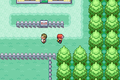

## Modular Naming Screen (WIP)
This injection adds the possibility for one to dynamically load a sprite as the input target for a naming screen.



### TODO
- [ ] Fix the palette issue.

### Usage
Instead of creating a new `struct NamingScreenTemplate` each time, you can just add an entry to: `NS_SPseudoSprites` in `src/data/ns_data.h`, by following the given examples in `src/data/ns_pseudosprites_images.h` and `src/data/ns_pseudosprites_anims.h`.

That newly added entry can now be referenced *by its id*, when calling the routine.
The "main" function, i.e. the one doing everything is `NS_LoadCustomNS`. To use it in a script, you just have to specify the `bufferId` in `VAR_RESULT` (aka `0x800D`), and the `spriteId` in `VAR_0x8004` (aka `0x8004`).

An example of usage can be seen in `assembly/sample.s`.

For now, only `16x32` sprites are supported, and the palette is still quite incorrect since it uses the menu's palette tag.

#### Cloning the repo
To get the repository, you can *clone* it using `git`:
```shell
$ git clone https://github.com/payst-t/ModularNamingScreen
```
Or alternatively, you can just download the repo as zip, ***which is only ever a good idea for this specific repository***.

### Build Instructions
The base requirements are exactly the same as the CFRU:
    - Python 3.7.4
    - devkitARM
    - grit (that you can get within the `deps.zip` file in the CFRU repo)
    - An 1.0 FireRed ROM named `BPRE0.gba` in the root folder.

Running `python scripts/make.py` (or `python3 on unix-like platforms`) should start the build process, and the insertion.

#### Configuration
##### Compile Time Constants

Open [scripts/make.py](scripts/make.py#L12) in a text editor to set some compile-time configuration.

The build system is smart enough to find enough free space on its own, and if you want it to be inserted at a particular address, you can specify it by updating the definition of `OFFSET_TO_PUT`:

```python
OFFSET_TO_PUT = 0x1C88650
SEARCH_FREE_SPACE = True   # Set to True if you want the script to search for free space
                           # Set to False if you don't want to search for free space as you for example update the engine
```

The build system will use `OFFSET_TO_PUT` to determine where in the ROM it should start looking for free space if `SEARCH_FREE_SPACE` is `True`.  Otherwise, the build system places the code to insert directly at `OFFSET_TO_PUT`.

#### Building the project itself
Once you're ready, run:

```shell
$ python scripts/make.py
```
This won't actually modify `BPRE0.gba`, instead your output will be in `test.gba`. Naturally, test it in an emulator before continuing.

### Credits
- Skeli, for the build system used here (from the [CFRU](https://github.com/Skeli789/Complete-Fire-Red-Upgrade))
- BluRose, for the [original template](https://github.com/BluRosie/firegold-code/tree/firegold).
- Everybody that contributed to the pret repositories (especially [pokeemerald](https://github.com/pret/pokeemerald), and [pokefirered](https://github.com/pret/pokefirered)).
- Spherical Ice, for the [Unown Report Code](https://github.com/sphericalice/bpre-unown-report)
